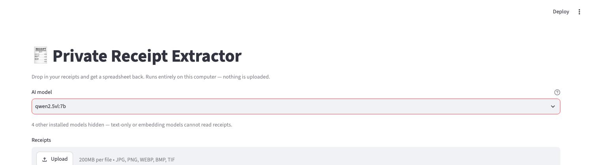
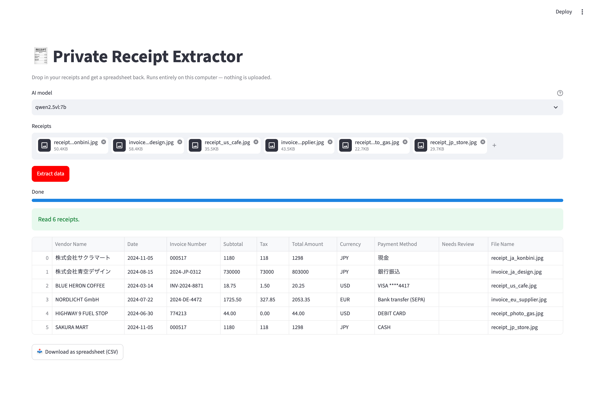

# Stop Uploading Your Receipts to Random Websites

## A receipt-to-spreadsheet tool that never leaves your laptop

If you run a small business you already know this routine. There's a shoebox of
receipts, a month-end deadline, and two unappealing ways through it: type every
line into a spreadsheet yourself, or find one of those free "invoice converter"
sites and hand your company's financial records to a stranger.

I've done both. The second one bothers me more than it seems to bother most
people. Those sites are free for a reason, and the reason is that your documents
are worth something, whether as training data, as marketing signal, or just as
files sitting on a server you have no control over. A receipt tells you who a
company buys from, what its margins look like, which staff member expensed
lunch, and the last four digits of a card.

There's a third option now, and it's finally good enough to bother with. Vision
models that can read a crumpled thermal receipt will run on an ordinary laptop,
offline, for nothing. No account, no API key, no upload. This post is the build.

I tested it before writing it up: six documents, three currencies, 48 fields,
and it got all 48. Two of those documents were entirely in Japanese and one was
a phone photo I ruined on purpose. So, how to build it, and the places where you
still have to look at the screen yourself.

---

## What you get

A page in your browser with a file picker. Drag in receipt images, press one
button, get a table you can download as a CSV and open in Excel, Numbers or
Google Sheets.



Behind that page, a vision model on your own machine reads each image and pulls
out vendor, date, invoice number, subtotal, tax, total, currency and payment
method.

Setup takes about 15 minutes. After that it's roughly 5 seconds a receipt.

Worth saying plainly up front: this replaces the typing, not the checking. You
still read the numbers before they go into your books. What you're buying is
maybe 90% of the tedium, not an accountant.

---

## What you need first

- A Mac or Windows laptop from the last four years or so. The model runs
  locally, which is the only real requirement here.
- 8 GB of RAM, though 16 is more comfortable. There's a smaller model below if
  you're on 8.
- About 7 GB of free disk for the download.
- The willingness to paste three commands into a terminal. You don't have to
  understand them and I'll give you the exact text.

---

## Two things to get out of the way

**This was built on a Mac.** All the code, the six test documents and every
accuracy figure below came off a macOS machine. Ollama, Python and Streamlit all
run on Windows perfectly well, so I expect the whole thing works there, but I
haven't rerun the tests to prove it. Where something differs on Windows I've put
in a note:

> **On Windows:** notes like this one.

Take those as the Windows equivalents as far as I know them, not as steps I've
verified end to end. Linux doesn't get a mention anywhere but behaves close
enough to the Mac path.

**Check the licence before you use this for paid work.** Free to download and
free to use in a business are two different things, and it's easy to conflate
them because nothing in the process ever asks you to agree to anything.
`ollama pull` just downloads. Every model in the library comes with its own
terms and they vary a lot. Some are permissive, some are research-only, some are
fine until you cross a revenue or user threshold, some put conditions on what
you're allowed to do with the output.

The part that catches people is that sizes within one family don't necessarily
share a licence. `qwen2.5vl:3b` and `qwen2.5vl:7b` are separate releases, so
check the tag you actually pulled rather than the family name. Locally:

```bash
ollama show qwen2.5vl:7b --license
```

Read that and the model card on the vendor's own site before you point this at a
client's books. If you're handling someone else's financial data under contract,
it's a question for whoever approves your software, not for a blog post.

---

## Step 1: Install Ollama

Ollama runs AI models on your computer. It's a normal app, roughly as exotic as
installing Spotify, and after the initial model download it doesn't talk to the
internet.

Get it from **[ollama.com](https://ollama.com)**, install it like anything else,
and open it once. A small llama shows up in your menu bar on a Mac or the system
tray on Windows, which means the engine is running. No signup, no account, no
card.

> **On Windows:** you get a single `OllamaSetup.exe`, and it installs into your
> own user folder rather than `Program Files`, so it won't ask for an admin
> password. It does add `ollama` to your `PATH`, but a terminal window you
> already had open won't have picked that up. Close it and open a fresh one
> before Step 2, or you'll get `'ollama' is not recognized as an internal or
> external command` and assume something went wrong with the install.


---

## Step 2: Get the model

Open a terminal. On a Mac, `Cmd+Space`, type Terminal, Enter. On Windows, Start
key, type Command Prompt, Enter.

> **On Windows:** PowerShell works just as well as Command Prompt and pastes with
> `Ctrl+V` like a normal application, where the old Command Prompt may want a
> right-click instead. Either is fine for everything in this post. The one thing
> to avoid is WSL. Ollama installed inside WSL is a separate engine from Ollama
> installed on Windows, and you'll download six gigabytes twice before working
> out why the app can't see your model.

Then:

```bash
ollama pull qwen2.5vl:7b
```

That's about 6 GB, so go and make coffee. It's a one-time thing.

> **On Windows:** models go to `C:\Users\<you>\.ollama\models`, so the 7 GB has
> to be free on `C:` specifically. A spacious `D:` drive won't help you. The Mac
> equivalent is `~/.ollama/models`.

Only 8 GB of RAM? Take the small one instead:

```bash
ollama pull qwen2.5vl:3b
```

3.2 GB, and it scored exactly the same as the 7b on every test I ran, Japanese
included. I did not expect that. If you're tight on space or memory, start here
and don't feel like you're settling for less.

---

## Step 3: Three Python libraries

Same terminal:

```bash
pip install streamlit pandas ollama pillow
```

streamlit makes the web page, pandas makes the spreadsheet, ollama talks to the
engine, and pillow tidies up the images before the model sees them.

If `pip` isn't recognised, get Python from [python.org](https://python.org) and
tick "Add Python to PATH" while installing.

> **On Windows:** Python isn't preinstalled, so you'll almost certainly need that
> download, and "Add Python to PATH" on the first installer screen is the
> checkbox everyone skips. Avoid the Microsoft Store version of Python too; its
> sandboxed file permissions produce strange Streamlit failures that are no fun
> to debug. Once it's in, use:
>
> ```
> py -m pip install streamlit pandas ollama pillow
> ```
>
> `py -m pip` rather than plain `pip` makes sure you're installing into the same
> Python that ends up running the app.

On a Mac you may get `error: externally-managed-environment` instead. That's a
Python safety guard, not something you broke. Either use
`pip3 install --user streamlit pandas ollama pillow`, or set up a virtual
environment in the project folder with
`python3 -m venv .venv && source .venv/bin/activate` and install inside that.

---

## Step 4: Get the app

The app is a single Python file, and it already lives on GitHub. Copying a few
hundred lines out of a blog post is a great way to lose a bracket somewhere on
line 300, so download it instead:

```bash
cd ~/Desktop
git clone https://github.com/yong-asial/ReceiptExtractor.git
cd ReceiptExtractor
```

If you don't have `git`, open [the repository][repo] in your browser, click the
green **Code** button, choose **Download ZIP**, and unzip it onto your
Desktop. GitHub names the unzipped folder `ReceiptExtractor-main`, so rename it
to `ReceiptExtractor` and the commands in the next step will match.

The repo pins the same four libraries from Step 3 in `app/requirements.txt`, so
if you skipped ahead — or want them in a virtual environment rather than
system-wide — `pip install -r app/requirements.txt` from inside the folder does
the whole of Step 3 in one line.

> **On Windows:** `cd %USERPROFILE%\Desktop` first, and if OneDrive is syncing
> your Desktop the real path is `%USERPROFILE%\OneDrive\Desktop`. Run
> `dir %USERPROFILE%` to see which of the two you have. The ZIP route works the
> same; right-click the download and choose **Extract All**.

You don't need to read the code to use it. The whole app is `app/app.py`, and
underneath the file handling and the table, the part that actually reads a
receipt is seven lines:

```python
response = ollama.chat(
    model=model,
    messages=[{"role": "user", "content": PROMPT, "images": [image_bytes]}],
    # temperature 0 keeps repeated runs on the same receipt consistent.
    options={"temperature": 0},
)
return normalise(parse_json(response["message"]["content"]))
```

That's the entire trick: hand the image and a prompt to a model running on your
own machine, and read the JSON back. `PROMPT` asks for eight named fields and
nothing else, and `normalise` cleans up what comes back — stripping currency
symbols, converting `1.725,50` to `1725.50`, turning `2024年11月5日` into
`2024-11-05`, and flagging any receipt whose subtotal and tax don't add up to
its total. Those details are worth a read in the file itself if you plan to
point this at real books; they're the difference between a demo and something
you'd trust.

---

## Step 5: Run it

Back in the terminal:

```bash
cd ~/Desktop/ReceiptExtractor
streamlit run app/app.py
```

> **On Windows:** backslashes, and it's safest to spell the path out:
>
> ```
> cd %USERPROFILE%\Desktop\ReceiptExtractor
> py -m streamlit run app\app.py
> ```
>
> In PowerShell, use `cd $HOME\Desktop\ReceiptExtractor` instead. Two gotchas
> here. If bare `streamlit` isn't recognised, `py -m streamlit` always works;
> it's the same program found a more reliable way. And if OneDrive is syncing
> your Desktop, the real path is `%USERPROFILE%\OneDrive\Desktop\...`, so run
> `dir %USERPROFILE%` to see which of the two you've got. You may also get a
> firewall prompt the first time, which you can safely cancel, since nothing
> here needs to accept connections from anywhere.

The browser opens by itself. Drag in some receipts, click **Extract data**, and
watch the bar. The first one takes 10-20 seconds while the model loads into
memory, then it settles down to about 5 seconds each.

When it finishes you get a green **Read 6 receipts.** line, the table, and a
download button:



That run is six documents in three languages and three currencies — a US cafe
receipt, a German invoice with `1.725,50` written the European way, a blurry
photo of a fuel receipt taken at an angle, and three Japanese documents — and
every field on every one of them is correct. The Japanese vendor names come
back as 株式会社サクラマート rather than a romanised guess, and the dates are
all normalised to `YYYY-MM-DD` no matter how the original was written.

**Download as spreadsheet (CSV)** gives you a file that opens straight into
Excel, Numbers, or Google Sheets. One warning: spreadsheet apps like to strip
the leading zeros off invoice numbers such as `000517`, so set that column to
Text on import if it matters to you.

`Ctrl+C` in the terminal stops it. Tomorrow, same two commands. (That's `Ctrl`
and not `Cmd`, even on a Mac.)

---

## So, was it worth it?

You now have a receipt reader that costs nothing per scan, works on a plane,
and never sends a client's bank details to a server you can't name. No
subscription, no per-page pricing, no data processing agreement to read.

The honest limits are worth stating. It's roughly five seconds a receipt, so
this is a tool for a shoebox of receipts at the end of a quarter, not for
thousands at a time. It needs about 6 GB of free memory for the 7B model,
though the 3B one scored identically on my tests and fits comfortably on an
8 GB machine. And it is a model reading an image, which means it will
eventually misread something — that's why the app checks whether subtotal plus
tax equals the total and flags the row when it doesn't. Look at the **Needs
Review** column before you trust a number.

What surprised me most was how good the small local models have got. I
expected to be writing a post about a clever-but-flawed weekend hack, and
instead `qwen2.5vl` read all 48 fields across all six test documents correctly,
including the deliberately bad phone photo and the Japanese invoice. Two years
ago this needed a cloud API and a per-page fee. Now it runs on a laptop, in a
file short enough to read in one sitting.

The code is on [GitHub][repo]. Change the field list, point it at your own
documents, or lift the seven lines that matter into something of your own — the
same pattern works for business cards, ID documents, handwritten notes, or any
other pile of paper you'd rather not type up by hand.

[repo]: https://github.com/yong-asial/ReceiptExtractor
